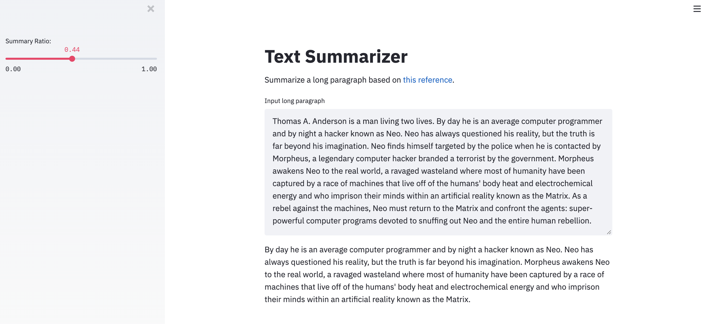

# Text Summarizer Web Application
Author: Xavier M. Puspus  


### Description
I used a text summarizer based off of [this paper](https://web.eecs.umich.edu/~mihalcea/papers/mihalcea.emnlp04.pdf). I built a web application that summarizes english text from plain text or url parsing. Link to the text summarizer can be found [here](https://text-summarizer-textrank.herokuapp.com/).
  

### Deployment Through Web Application

I used the most recently released API of [Streamlit](https://streamlit.io) to deploy the ml model and locally serve the web app.

### Running the App

In order to run the app, you must have `gensim` available on your machine, and install streamlit using:

```console
foo@bar:~$ pip install streamlit
```
Afterwards, `cd` into the directory of `app.py` and run this on the terminal:

```console
foo@bar:~$ streamlit run app.py
```

### Display

The web app should look something like this:

