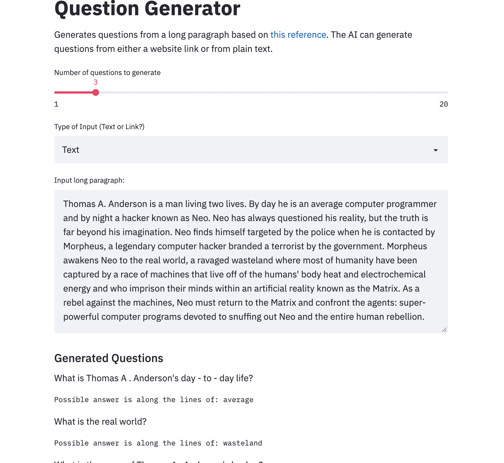

# Auto-Question Generation Web Application
Author: Xavier M. Puspus  


### Description
I used a BERT wrapper based off of [this paper](https://arxiv.org/abs/1810.04805). I built a web application that generates questions and possible answers from plain text or url parsing. Link to the question generator can be found [here](https://bert-question-generator.herokuapp.com/).
  

### Deployment Through Web Application

I used the most recently released API of [Streamlit](https://streamlit.io) to deploy the ml model and locally serve the web app.

### Running the App

In order to run the app, you must have `text2text` available on your machine, and install streamlit using:

```console
foo@bar:~$ pip install streamlit
```
Afterwards, `cd` into the directory of `app.py` and run this on the terminal:

```console
foo@bar:~$ streamlit run app.py
```

### Display

The web app should look something like this:


